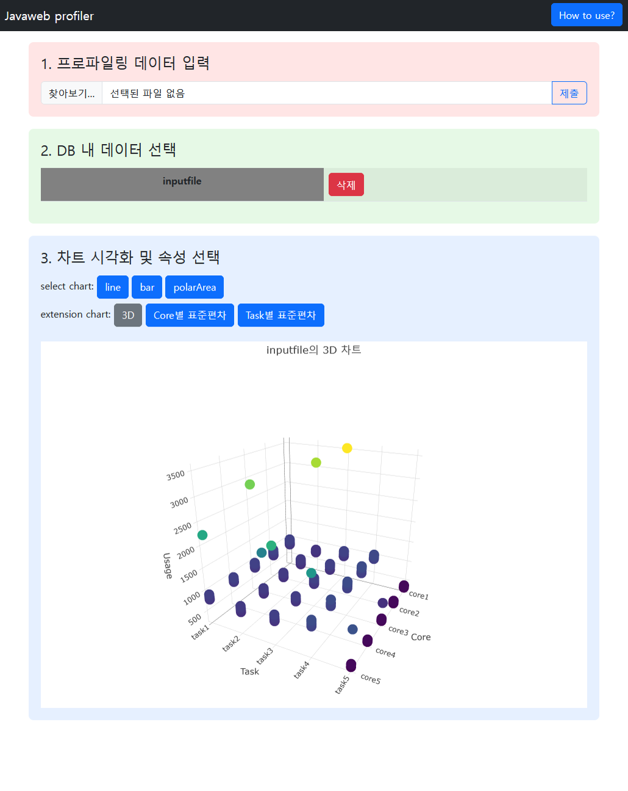
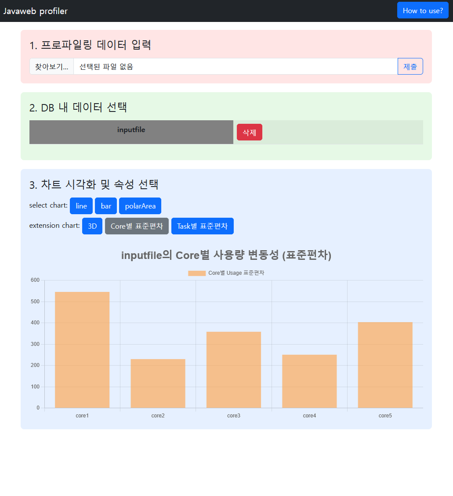
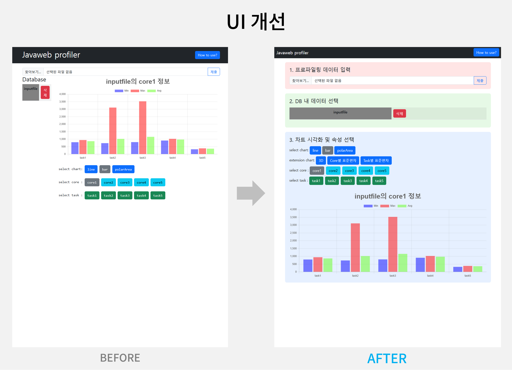
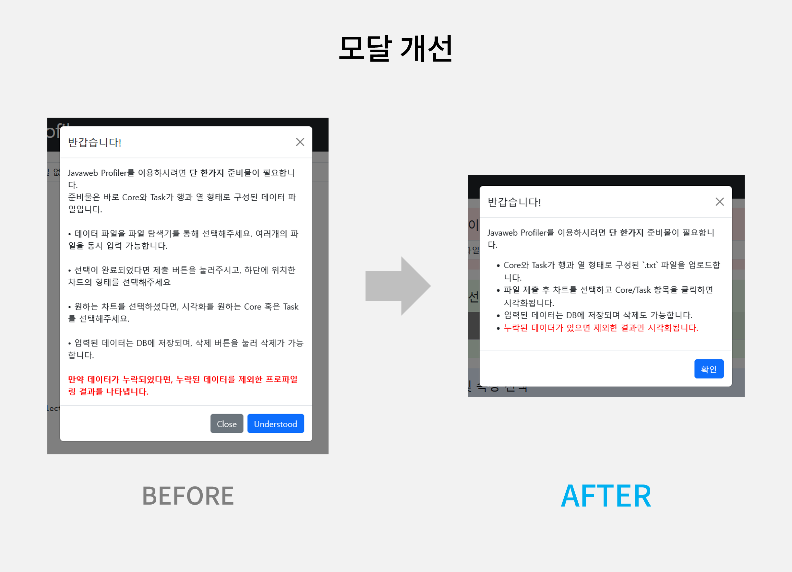

# 웹응용기술[001] 14주차 과제 보고서

## 시작에 앞서
해당 보고서는 원고 작성을 완료한 뒤, ChatGPT 등의 **LLM**을 활용하여 오류 수정, 내용 첨삭 및 Markdown 문법을 적용하여 작성되었음을 알립니다.

본 보고서에는 다음 내용을 포함하고 있습니다.
- 기본 과제 - 프로그램 수행 절차 분석
    - 전체적인 데이터 처리 흐름 분석 (파일 업로드 → DB 저장 → 시각화 요청)
    - 주요 서버/라우터/프론트엔드 구성 파일별 역할 정리
    - 핵심 함수 및 라우터 동작 방식에 대한 기술적 설명
- 확장 과제 - 독자적인 프로파일러 개발
    - Plotly 라이브러리를 활용한 3차원 그래프
    - 표준편차 시각화를 위한 라우터 및 차트 추가
    - 페이지 디자인을 보다 직관적으로 개선

---

## 프로그램 수행 절차 분석

이 프로젝트는 사용자가 `.txt` 파일을 업로드하면 Core/Task 기반의 성능 지표 데이터를 분석하고, 다양한 차트로 시각화하는 웹 기반 도구입니다.  
백엔드는 Node.js (Express), **Sequelize ORM**으로 구성되어 있으며, 프론트엔드는 HTML, Bootstrap, Chart.js 기반으로 동작합니다.

---

### 1. 전체 흐름 요약

```
 → 1. 파일 업로드
 → 2. 서버에 데이터 저장
 → 3. DB 테이블 목록 조회 및 삭제
 → 4. Core/Task 선택
 → 5. 차트 버튼 클릭 → 시각화 렌더링
```

---

### 2. 주요 파일 구성 및 역할

#### routes/index.js – 메인 페이지 라우팅

- **GET 요청** 시 메인 페이지를 렌더링
- 현재 DB에 존재하는 테이블 리스트를 조회하여 웹앱에 전달
- `models/index.js`의 `getTableList()` 함수 호출

```js
router.get('/', async (req, res) => {
  getTableList()
    .then((tableList) => {
      res.render('index', { tableList });
    });
});
```

#### routes/profiles.js – 데이터 처리 및 API 제공

- 업로드된 `.txt` 파일 데이터를 기반으로 Sequelize 모델 생성
- 동적 테이블을 생성하거나 삭제함
- Core/Task 기준 통계 데이터를 반환하는 API 포함

핵심 라우터 목록:

| Method | Endpoint | 설명 |
|--------|----------|------|
| POST | `/profiles` | 업로드된 프로파일 데이터 처리 및 테이블 생성 |
| GET | `/profiles` | DB에 존재하는 테이블 목록 조회 |
| GET | `/profiles/data/:tableName` | 전체 데이터 및 Core/Task 목록 조회 |
| GET | `/profiles/coredata/:tableName/:core` | Core 기준 Task별 통계 (min, max, avg) |
| GET | `/profiles/taskdata/:tableName/:task` | Task 기준 Core별 통계 (min, max, avg) |
| DELETE | `/profiles/drop/:tableName` | 테이블 삭제 |

#### public/sequelize.js – 클라이언트 인터랙션 및 시각화 로직

- 사용자가 업로드한 파일을 읽고 파싱함
- 선택된 테이블에 대해 Core/Task 버튼을 생성
- 각 버튼 클릭 시 API 호출 → Chart.js로 시각화

핵심 함수:

| 함수명 | 설명 |
|--------|------|
| `getList()` | DB 테이블 목록을 가져와 UI에 표시 |
| `getdata()` | 특정 테이블의 Core/Task 목록을 가져와 버튼 생성 |
| `updateChart(type, value)` | Chart.js를 통해 차트를 렌더링 |
| `draw3DPlot()` | Plotly 기반 3D 차트 렌더링 (확장 기능, 원래는 없음) |

#### app.js – Express 서버 초기화 및 설정

- Express 서버를 설정하고 실행하는 진입점
- Nunjucks 템플릿 연결
- Sequelize DB 초기화
- 정적 리소스 제공 (`public/`)
- 라우터 등록 및 에러 핸들링 포함

```js
app.use('/', indexRouter);
app.use('/profiles', profilesRouter);
```

#### models/index.js – Sequelize 유틸 함수 및 연결

- `Sequelize` 인스턴스를 초기화하고 DB 연결 수행
- 동적으로 테이블을 생성하거나 삭제할 수 있는 함수 포함

| 함수명 | 설명 |
|--------|------|
| `createDynamicTable(profile)` | `.txt` 파일 내용을 기반으로 동적 테이블 생성 |
| `dropTable(name)` | 특정 테이블 삭제 |
| `getTableList()` | 현재 DB에 존재하는 테이블 목록 반환 |

#### models/profile.js – 공통 모델 정의 (동적 생성 목적)

- `initiate()` 함수로 테이블명을 인자로 받아 동적으로 모델을 정의
- Core, Task, usaged 세 필드로 구성

```js
Profile.init({
  core: Sequelize.STRING,
  task: Sequelize.STRING,
  usaged: Sequelize.INTEGER
}, {
  tableName: tableName,
  timestamps: false
});
```

---

### 3. 기술 스택

| 영역 | 기술 |
|---|---|
| 서버 | Node.js, Express |
| ORM | Sequelize |
| DB | MySQL |
| 클라이언트 | HTML, Bootstrap 5, Chart.js |
| 기타 | axios, FileReader API |

---

## 독자적인 프로파일러 개발

본 프로젝트의 기존 구조를 유지하면서 다음과 같은 기능을 직접 구현 및 통합하였습니다.

---

### 1. 3D 시각화 차트 추가



#### 기존 2D 차트 외에 Core, Task, Usage 세 값을 좌표로 하는 3차원 산점도 추가
해당 데이터는 Core, Task에 따른 Usage를 표시하기 때문에 Core나 Task를 결정해야
2차원 표로 표현할 수 있었습니다.
그러나, 두가지 분류 (Core, Task)를 구분하지 않고 동시에 보아야 하는 경우를 감안하여 3차원 그래프를 추가 구현했습니다.

#### 라이브러리
3차원 그래프 표현을 위한 **Plotly.js** 라이브러리 활용

#### 3D 그래프 인터랙션
아래는 Plotly 3D 그래프 인터랙션 종류에 대한 나열입니다.
|조작|설명|
|---|---|
|마우스 왼쪽 드래그|그래프 3차원 회전 (Turntable 회전)|
|마우스 오른쪽 드래그|그래프 수평 이동 (Pan 이동)|
|마우스 휠 Up/Down|그래프 줌 인 / 줌 아웃 (확대, 축소)|

이 외에도 그래프 우측 상단의 조작 메뉴를 통해 상호작용할 수 있습니다.


#### 차트 전환 시 canvas 대신 div를 사용하도록 구조를 분리
div를 기용하여 style.display 옵션으로 표시 유무 결정

```js
async function updateChart(type, choose_name) {
    // 2차원 그래프(line, bar, polarArea) 선택 시
    // 2차원 차트 영역 활성화, 3차원 그래프 영역 비활성화
    document.getElementById("profilerChart").style.display = "block";
    document.getElementById("profilerPlot").style.display = "none";
    ...
}
async function draw3DPlot() {
    ...
    // 3차원 그래프 선택 시
    // 2차원 차트 영역 비활성화, 3차원 그래프 영역 활성화
    document.getElementById("profilerChart").style.display = "none";
    document.getElementById("profilerPlot").style.display = "block";
    ...
}
```

---

### 2. 표준편차 기반 통계 시각화 추가



#### 2.1 Core별 표준편차

- 각 Core에 대해 Task별 usaged의 표준편차 계산
- 막대그래프로 표현
- 백엔드 라우터 `/profiles/deviation/core/:tableName` 추가

#### 2.2 Task별 표준편차

- 각 Task에 대해 Core별 usaged의 표준편차 계산
- 백엔드 라우터 `/profiles/deviation/task/:tableName` 추가

```js
async function drawCoreDeviationChart() {...}
async function drawTaskDeviationChart() {...}
```

---

### 3. UI 디자인 리뉴얼



- 기존 HTML 구조의 중복/비효율 제거
  - 불필요하게 남용된 div 및 container 제거
- 사용자가 상호작용해야하는 순서 흐름에 맞게 3개의 구역으로 구분
  1. 파일 업로드 구역 (연한 빨간색 배경)
  2. DB 테이블 선택 구역 (연한 녹색 배경)
  3. 차트/속성 선택 구역 (연한 파란색 배경)
- 차트 선택 버튼들을 1줄 정렬로 정리하고 시각적 상태 강조

---

### 4. 모달 개선



- 페이지 헤더의 `How to use?` 버튼이 존재하고, 사용방법을 안내하는 모달이 열리나 이를 닫는 함수가 없었습니다.
- 오로지 `data-bs-dismiss="modal"` 태그에 의존하여 모달이 닫히며, `understood` 버튼은 어떤 동작도 하지 않았습니다..
- 불필요한 버튼을 없애고 `data-bs-dismiss="modal"` 태그를 포함한 `확인` 버튼만 남겼습니다.
- 또한, 기존에 특수문자를 하드코딩하여 삽입된 글머리 기호를 `<li>` 태그로 표현했습니다.
- 복잡하게 설명된 내용을 간결하게 정리했습니다.

## 결과 요약

- 기능 개선에 따른 코드 증가는 최소화하며, 기존 구조와의 호환성을 유지했습니다.
- 차트 선택 및 시각화 응답 시간이 크게 개선되었으며, 사용자 편의성을 고려한 레이아웃 재배치와 기능별 모듈화도 완료했습니다.
